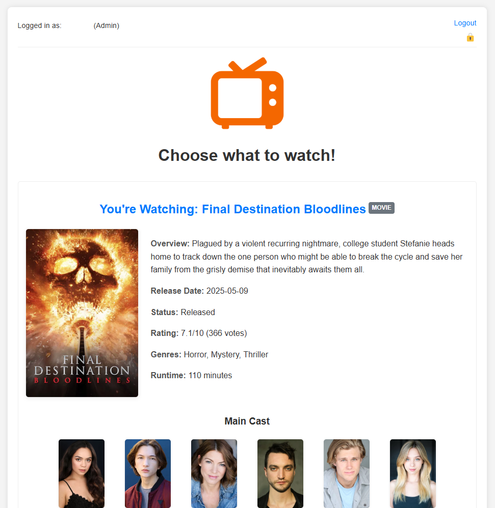

# Watch

A simple PHP and JavaScript-based application that allows users to create a watchlist of movies and TV shows using The Movie Database (TMDB) API, and then randomly pick an item to watch. It features user registration/login, individual watchlists, and admin controls for registration.
## Features

- **User Authentication:** Secure registration and login system using PHP password_hash.
- **Individual Watchlists:** Each user has their own private watchlist stored in JSON files.
- **TMDB API Integration:** Search for movies and TV shows via the TMDB API.
- **Add & Remove from Watchlist:** Easily manage items in your watchlist.
- **Click to View Details:** Click on any watchlist item to see its detailed information (overview, cast, images, etc.).
- **Random Picker:**
    - A "Decide!" button to randomly select an item from the user's watchlist, with an animation.
    - Improved randomisation to avoid picking the same item consecutively if other options exist. 
- **Admin Role:** 
    - Manually assignable admin role by editing a user's JSON file.
    - Admin can toggle user registrations on/off via a discrete UI element.
- **Flat-File Storage:** Uses JSON files for storing user data, watchlists, and application configuration (no database required).
- **Responsive Design:** Basic responsive styling for usability on different screen sizes.
## Screenshots


## Technologies Used

- PHP (7.x or higher recommended)
- JavaScript (Vanilla)
- HTML5
- CSS3
- [The Movie Database (TMDB) API](https://www.themoviedb.org/documentation/api)
- JSON (for data storage)
## Setup Instructions

Follow these steps to set up the application on your own web server (e.g., a cPanel host):

**1. Prerequisites:**

- A web server with PHP support.
- PHP cURL extension enabled (for making API calls to TMDB).
- Write permissions for the PHP process on specific directories (`users/, watchlists/`) and files (`config.json`).

**2. Clone or Download the Repository:**

Clone the repository to your local machine or server:

```
git clone https://github.com/lastrider04/watch.git
cd watch 
```
Alternatively, download the ZIP file from GitHub and extract it to your web server's document root (e.g., public_html/movie-picker/).

**3. Configure TMDB API Key (Crucial & Sensitive):**

This application _**requires**_ a TMDB API key.

- **Get an API Key:** If you don't have one, sign up at [The Movie Database (TMDB)](https://www.themoviedb.org/signup) and request an API key from your account settings page. It's free.
- **Create Configuration File (Outside Web Root):** For security, your API key should not be in a web-accessible directory.
    - On your server, navigate to a directory **above your web root** (e.g., if your web root is `/home/cpaneluser/public_html/`, you might use `/home/cpaneluser/`).
    - Create a directory named `app_config` (e.g., path becomes `/home/cpaneluser/app_config/`).
    - Inside this `app_config` directory, create a PHP file named `api_keys.php`.
- **Add Your API Key to `api_keys.php`:** Open the newly created `/home/cpaneluser/app_config/api_keys.php` and add the following content, replacing `YOUR_ACTUAL_TMDB_API_KEY_HERE` with your real key:

    ```
    <?php
    // File: /home/your_cpanel_username/app_config/api_keys.php
    // IMPORTANT: Store this file OUTSIDE your web-accessible  public_html directory.

    define('MY_APP_TMDB_API_KEY', 'YOUR_ACTUAL_TMDB_API_KEY_HERE');
    ?>
    ```
    - **Update Path in `index.php`:** Open the main `index.php` file from this project. Near the top, find the section for loading the API key:

    ```
    // $apiKeyConfigFile = '/home/your_cpanel_username/app_config/api_keys.php';
    ```
    Uncomment this line (remove the //) and **replace `your_cpanel_username` with your actual cPanel username or the correct absolute server path to your `app_config` directory.** This path must be correct for the application to load the key.

**4. Create Data Directories and Application Configuration File:**

The application stores user data, watchlists, and registration settings in JSON files.

- In the root directory of the application (where `index.php` is located), create the following directories:
    - `users/`
    - `watchlists/`
- Also in the root directory, create a file named `config.json` with the following initial content:

```json
{
    "registrations_enabled": true
}
```
- **Set Write Permissions:** The web server (PHP process) needs to be able to write to the `users/` and `watchlists/` directories, and to the `config.json` file.
    - Using cPanel's File Manager, you can set permissions. Typically, `755` or `775` for directories and `644` or `664` for `config.json` should work if the files are owned by your cPanel user.
    - If using SSH:
    ```
    # Navigate to your app's root directory
    chmod 775 users/
    chmod 775 watchlists/
    chmod 664 config.json
    ```
    - **Note:** The `app_config/api_keys.php` file should only need to be readable by the PHP process, not writable.

**5. (Optional) Placeholder Images:**

The `images/` directory should contain:
- `Placeholder.png` (for items without a poster)
- `app_logo.png` (the application's logo displayed at the top)
- `favicon.ico` (the browser tab icon)

You can replace these with your own images.

**6. Access the Application:**
Open your web browser and navigate to the URL where you've uploaded the application files (e.g., `http://yourdomain.com/movie-picker/)`.

**7. Register First User & Designate Admin:**

- Go to the `register.php` page (e.g., `http://yourdomain.com/movie-picker/register.php`) to create your first user account.
- To make this user an administrator:

    1. Access your server's file system (via cPanel File Manager or SSH).
    2. Navigate to the `users/` directory within your application.
    3. You will see a JSON file named after the username you just registered (e.g., `youradminusername.json`).
    4. Open this JSON file for editing.
    5. Add an `isAdmin` flag set to `true`. For example
        ```
        {
        "username": "YourAdminUsername",
        "password_hash":  "$2y$10$xxxxxxxxxxxxxxxxxxxxxxxxxxxxxxxxxxxxxxxxxxxxxxxxxxxxx",
        "isAdmin": true
        }
        ```
        (Ensure you keep the existing `username` and `password_hash` intact, just add the comma and the `isAdmin` line.)    
    6. Save the file.

- Now, log out and log back in with this user account. You should see the admin control icon in the header.

## How to Use

- **Register/Login:** Create an account or log in.
- **Search:** Use the search bar on the main page (`index.php`) to find movies or TV shows. Results will appear below.
- **Add to Watchlist:** Click the "Add" button next to a search result.
- **View Watchlist:** Your added items will be displayed in the "Your Watchlist" section.
- **View Details:** Click on the title or poster of any item in your watchlist to see its detailed information (overview, cast, images, rating, etc.).
- **Remove from Watchlist:** Click the "Remove" button next to an item in your watchlist.
- **Decide!:** When you can't choose what to watch, click the "Decide!" button. The app will animate through your watchlist posters and randomly select one for you, then display its details.
- **Spin Again:** From the details page of a randomly selected item, click "Spin Again!" to return to the main page and be ready for another random pick.
- **Admin Controls** (if logged in as Admin):
    - A small lock icon (🔓 or 🔒) will appear in the user information area at the top right.
    - Clicking this icon will toggle whether new user registrations are enabled or disabled for the entire application. The icon changes to reflect the current state and the action it will perform.

## Contributing
Pull requests are welcome. For major changes or new features, please open an issue first to discuss what you would like to add or change.

When contributing, please try to maintain the existing coding style and ensure that any new features are also documented.
## License
This project is licensed under the MIT License - see the [LICENSE](LICENSE) file for details.
